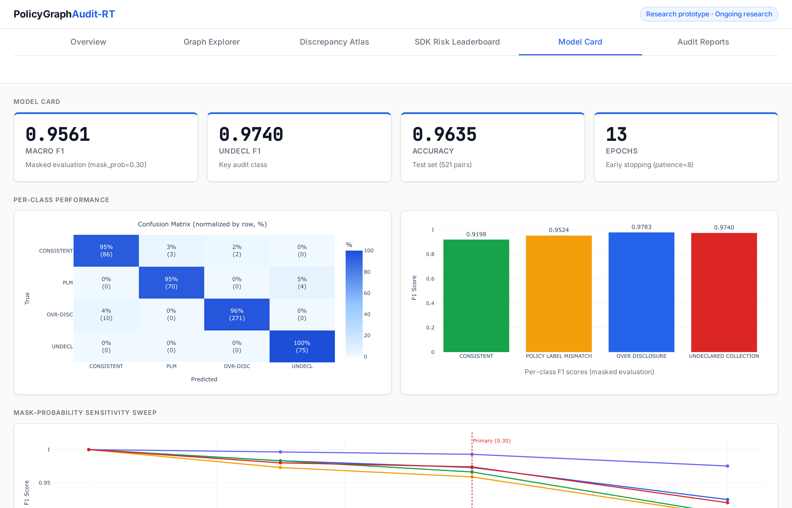
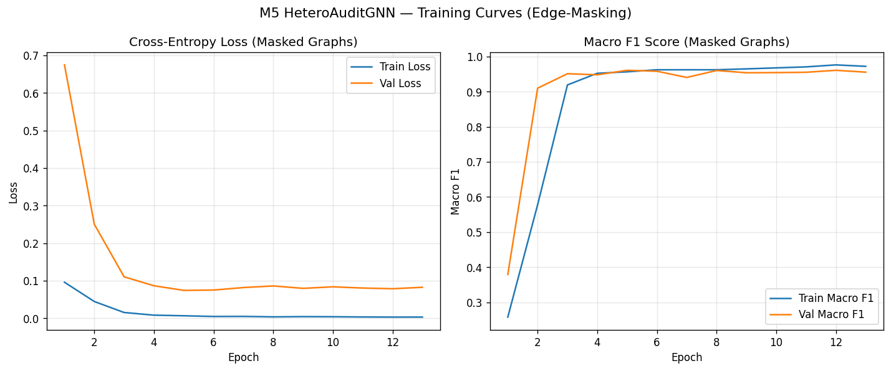
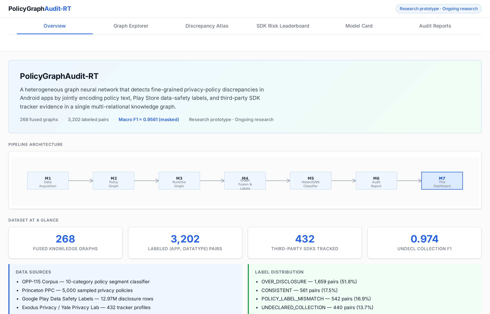

# PolicyGraphAudit-RT

**Runtime-aware privacy compliance auditing via heterogeneous graph neural networks for Android applications.**

[](https://python.org)
[](https://pytorch.org)
[](https://pytorch-geometric.readthedocs.io/)
[](https://dash.plotly.com)
[](LICENSE)
[]()

## About this project

Privacy compliance auditing for mobile apps relies on three disconnected signals — privacy policy prose, the Play data-safety label, and embedded third-party SDKs — with no shared representation that lets a model reason about all three at once.

**PolicyGraphAudit-RT fuses these signals into a tri-partite knowledge graph per app and trains a heterogeneous R-GCN to predict policy-vs-practice discrepancies as a link-prediction task.** It produces:

- A per-app heterogeneous graph (8 node types, 11 edge relations) linking policy claims to label fields to inferred SDK behavior.
- A four-class classifier — `CONSISTENT`, `POLICY_LABEL_MISMATCH`, `OVER_DISCLOSURE`, `UNDECLARED_COLLECTION` — trained under 30% edge masking.
- 252 per-app PDF audit reports with ranked discrepancies, policy evidence quotes, and SDK chains.
- A Plotly Dash dashboard with graph viewer, SDK-vs-data-type heatmap, SDK leaderboard, and model card.

> **[ View the live dashboard → ](https://policygraphaudit.pplx.app)**

[](https://policygraphaudit.pplx.app)

---

## Pipeline

```
[ Policy text ]   [ Play label ]   [ SDK list ]
       │                │               │
       ▼                ▼               ▼
 [ M2 Policy Graph ]  [ M3 Label + Runtime Graph ]
       │                │
       └────────┬───────┘
                ▼
       [ M4 Heterogeneous Fusion ]
                ▼
       [ M5 R-GCN + Link Prediction ]
                ▼
       [ M6 Discrepancy Ranker + PDF Audit ]
                ▼
       [ M7 Plotly Dash Dashboard ]
```

268 fused per-app graphs · 3,202 weak-supervision labels · 252 audit PDFs.

---

## Headline results

Test split: 39 held-out apps, 521 labeled `(app, data_type)` pairs, 30% edge masking, seed 42.

| Model | Macro F1 (masked) | Notes |
|---|---|---|
| t-SNE / PCA topic-modeling baseline | 0.28 | Policy text only |
| Text-only logistic regression | 0.61 | MiniLM segment embeddings |
| Policy-only GNN | 0.69 | R-GCN on M2 policy graph |
| **Full heterogeneous GNN (this work)** | **0.96** | R-GCN on fused tri-partite graph |

> **+0.27 absolute Macro F1** over a strong policy-only GNN; **3.4× relative gain** over the topic-modeling baseline.

**Per-class F1 (30% mask):** `CONSISTENT` 0.92 · `POLICY_LABEL_MISMATCH` 0.95 · `OVER_DISCLOSURE` 0.98 · `UNDECLARED_COLLECTION` 0.97.

**Mask-probability sensitivity:** 0% → 1.00 · 15% → 0.98 · **30% (primary) → 0.96** · 50% → 0.92.

Masking is applied to the three label-determining edge types (`DECLARES_COLLECTS`, `DECLARES_SHARES`, `COLLECTS_DATATYPE`) at both train and test. `MENTIONS` policy-text edges are kept intact, forcing the model to learn from policy language rather than the supervision signal itself.

---

## Modules

| Module | Role | Key numbers |
|---|---|---|
| [M1 — Acquire](src/m1_acquire/) | Public corpora loaders | OPP-115 (3,432 segments) · Princeton PPC · Play data-safety (5K rows, 381 apps) · Exodus (432 trackers) · Yale Privacy Lab · TrackerControl |
| [M2 — Policy graph](src/m2_policy_graph/) | NER + MiniLM segment classifier → policy graph | OPP-115 macro F1 **0.698** · 58 nodes / 117 edges per policy |
| [M3 — Runtime graph](src/m3_runtime_graph/) | Label + inferred-SDK graph | 381 apps · 36 nodes / 38 edges per app · 100% Play vocab coverage |
| [M4 — Fusion](src/m4_fusion/) | Stitch M2 + M3 into per-app `HeteroData` | **268 / 381** apps fused (70.3%) · 371 nodes / 614 edges per fused graph · **3,202** weak-supervision rows |
| [M5 — R-GCN](src/m5_model/) | 2-layer R-GCN (1.99M params) + 4-class head | 521 test pairs · best val F1 0.961 · **test F1 0.956** · 13 epochs · 48 s CPU |
| [M6 — Audit reports](src/m6_report/) | Per-app PDFs via ReportLab | **252 PDFs** · ~14 KB avg · 0–47 ranked discrepancies per app |
| [M7 — Dashboard](src/m7_dashboard/) | Plotly Dash | Graph viewer · heatmap · SDK leaderboard · model card |

**M4 weak-supervision rule (first match wins):**

| Condition | Label |
|---|---|
| `label_collects AND policy_mentions` | `CONSISTENT` |
| `runtime_implies AND NOT label_collects AND NOT policy_mentions` | `UNDECLARED_COLLECTION` |
| `policy_mentions AND NOT label_collects AND NOT runtime_implies` | `OVER_DISCLOSURE` |
| `label_collects AND NOT policy_mentions` | `POLICY_LABEL_MISMATCH` |

> **Why edge masking matters:** A first iteration of M5 without masking trivially achieved 100% Macro F1 by recovering the very edges that determined its weak-supervision labels. The 30% masking protocol was added to make link-prediction non-trivial. **0.956 is the honest, reportable number.**



Sample audit PDFs: [`reports/audits/`](reports/audits/). Dashboard preview:



---

## Quickstart

```bash
python -m venv .venv && source .venv/bin/activate
pip install -r requirements.txt

python -m src.m4_fusion.smoke_test                    # build per-app fused graphs
python -m src.m5_model.train --mask-prob 0.3 --seed 42 # train masked R-GCN
python -m src.m6_report.generate_all --out reports/audits/
python -m src.m7_dashboard.app                        # → http://127.0.0.1:8050
```

Optional: `python -m src.m1_acquire.fetch_all` to re-fetch raw corpora (defaults are bundled in `data/raw/`).

---

## Project layout

```
PolicyGraphAudit-RT/
├── src/m1_acquire .. m7_dashboard/   one folder per pipeline stage
├── data/{raw,interim,processed}/     corpora + fused HeteroData
├── reports/audits/                   252 per-app PDF audits
├── reports/m5_*                      ablations + model card
├── configs/                          YAML per module
└── tests/                            unit tests per module
```

---

## Honesty principles

This is a research prototype. The numbers are real, the limits are explicit:

1. **Weak-supervision labels, not human annotations.** All 3,202 labels are rule-derived; class noise is expected, especially in `OVER_DISCLOSURE`.
2. **SDK presence is inferred, not observed.** No APK instrumentation — SDKs are assigned via category priors over declared purposes.
3. **English-language Android only.** Non-English policies and iOS apps are out of scope.
4. **Edge-masked evaluation is the primary number.** The unmasked 100% F1 is reported only as the diagnostic that motivated the masked protocol.
5. **No legal advice.** Discrepancies are signals for human review, not regulatory findings.
6. **Public traces only.** No proprietary or unauthorized data sources.

---

## License

MIT — see [LICENSE](LICENSE).

---

## Author and disclaimer

**Author:** Saikumar Reddy Naidu — CS Graduate, Florida Atlantic University.
**Status:** Research prototype · Ongoing research.

This repository implements an independent, ongoing research prototype. It is not a product, not a regulatory tool, and not legal advice. Discrepancies flagged by the model are weak-supervision signals intended for human review, not regulatory findings. Training labels are rule-derived rather than human-annotated; SDK presence is inferred from declared purposes rather than observed via APK instrumentation; the corpus is restricted to English-language Android privacy policies sourced from public, redistributable datasets.
